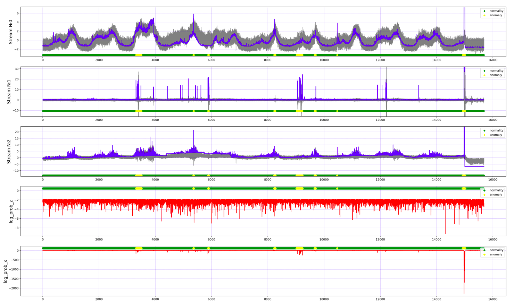
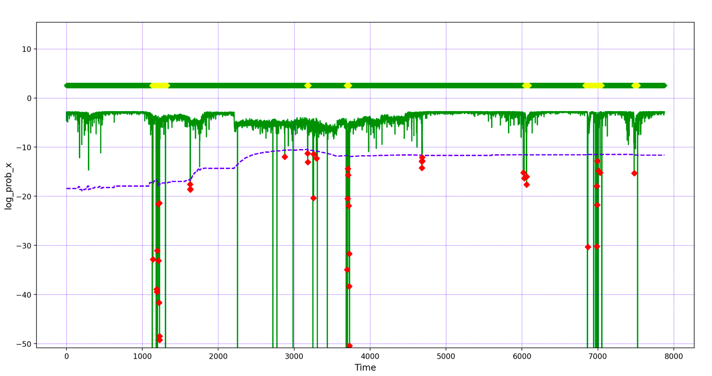

# Time-Series-Anomaly-Detection
An approach for detecting anomalies in time series using a Variational Autoencoder and the Theory of Extreme Values

## Stack
- [pytorch](https://pytorch.org/)
- [streamlit](https://streamlit.io/)

## Setup

Clone the repository and change the working directory:

    git clone https://github.com/SvNext/Time-Series-Anomaly-Detection.git
    cd Time-Series-Anomaly-Detection
Create and activate the virtual environment:

    python3 -m venv env
    source env/bin/activate
Install requirements:

    pip install -r requirements.txt

Run app.py file:

    streamlit run app.py
    
    
## Results

